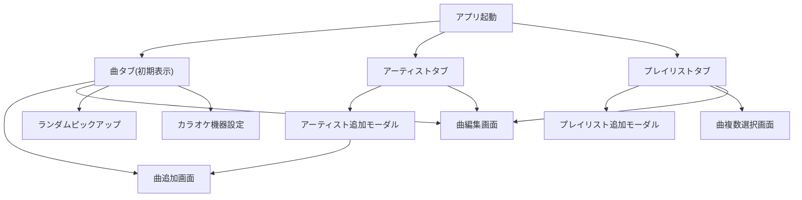

# 全体概要

## 1. 目的

本ドキュメント群は、既存の Flutter アプリ `KaraokeMemo` を Kotlin で Android 再実装するための基準設計である。

主目的は以下の通り。

- 既存機能の欠落ない移植
- Android 実装時の責務分割の明確化
- 機能単位での実装順序整理

## 2. 設計方針

- 実装言語は Kotlin
- UI は Jetpack Compose を前提とする
- 端末内ローカル保存を基本とする
- 不要な外部通信は追加しない
- 広告を除きネットワーク依存を持たない
- APIキーや広告IDはコードへ直書きしない
- 現行 Flutter 実装の機能互換を優先する

## 3. アプリ概要

KaraokeMemo は、カラオケで歌う曲を端末内で記録・整理するアプリである。

主要機能は以下。

- 曲の登録、編集、削除
- 曲の検索、並び替え、ランダム抽出
- アーティスト単位での曲整理
- プレイリスト単位での曲整理
- カラオケ機器設定
- バナー広告表示

## 4. 画面一覧

- 曲一覧画面
- 曲追加画面
- 曲編集画面
- アーティスト一覧画面
- アーティスト追加モーダル
- プレイリスト一覧画面
- プレイリスト追加モーダル
- 曲複数選択画面
- カラオケ機器設定モーダル
- ランダムピックアップモーダル

## 5. 全体遷移図

## 6. タブ構成

下部ナビゲーションは3タブ固定。

- アーティスト
- 曲
- プレイリスト

初期表示は「曲」。

## 7. 実装優先順位

### Phase 1

- データモデル定義
- Room / DataStore 構築
- 下部タブ構成
- 曲一覧
- 曲追加 / 編集 / 削除

### Phase 2

- アーティスト一覧
- プレイリスト一覧
- まとめて追加
- 検索 / 並び替え / ランダム抽出

### Phase 3

- カラオケ機器設定
- 広告
- テーマ調整
- テスト強化

