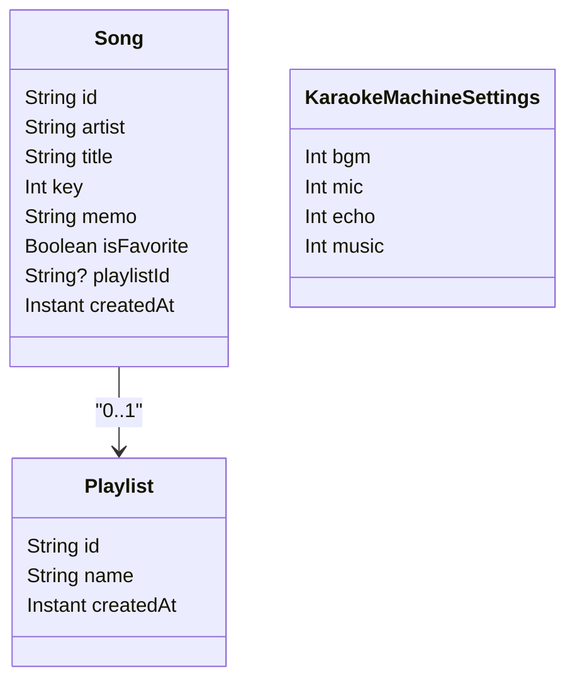

# ドメインモデルとデータ設計

## 1. エンティティ

### Song

- `id: String`
- `artist: String`
- `title: String`
- `key: Int`
- `memo: String`
- `isFavorite: Boolean`
- `playlistId: String?`
- `createdAt: Instant`

### Playlist

- `id: String`
- `name: String`
- `createdAt: Instant`

### KaraokeMachineSettings

- `bgm: Int`
- `mic: Int`
- `echo: Int`
- `music: Int`

## 2. モデル関係



## 3. ドメインルール

- 曲は `(artist, title)` の組み合わせで一意
- 曲の重複判定は大文字小文字を無視する
- プレイリスト名は一意
- プレイリスト名の重複判定も大文字小文字を無視する
- 曲は0件または1件のプレイリストにのみ所属する
- アーティストは独立マスタを持たず、曲データから導出する

## 4. 永続化方針

Android 実装では以下を前提とする。

- 曲、プレイリストは `Room`
- 軽量設定は `DataStore`

## 5. 永続化対象

### Room

- `songs`
- `playlists`

### DataStore

- 現在のカラオケ機器
- 機器ごとの設定値
- ピン留めアーティスト集合
- ピン留めプレイリスト集合
- 最後に使ったアーティスト名

## 6. テーブル設計案

### songs

- `id TEXT PRIMARY KEY`
- `artist TEXT NOT NULL`
- `title TEXT NOT NULL`
- `key_value INTEGER NOT NULL`
- `memo TEXT NOT NULL`
- `is_favorite INTEGER NOT NULL`
- `playlist_id TEXT NULL`
- `created_at INTEGER NOT NULL`

### playlists

- `id TEXT PRIMARY KEY`
- `name TEXT NOT NULL`
- `created_at INTEGER NOT NULL`

## 7. パッケージ構成案

```text
app/
  src/main/java/.../karaokememo/
    data/
      local/
      repository/
    domain/
      model/
      usecase/
    ui/
      common/
      song/
      artist/
      playlist/
      settings/
      navigation/
```

