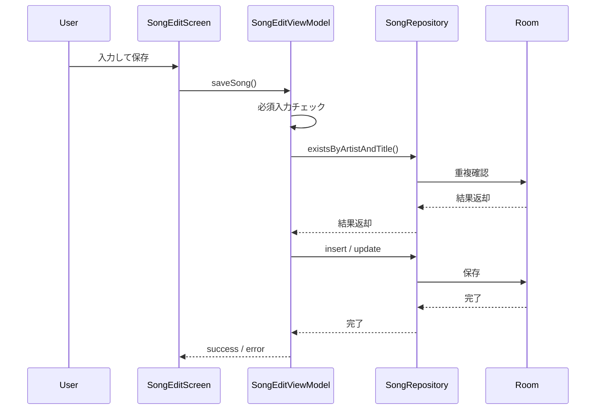

# 曲機能設計

## 1. 対象機能

- 曲一覧表示
- 曲追加
- 曲編集
- 曲削除
- お気に入り切替
- 検索
- 並び順変更
- ランダムピックアップ

## 2. 曲一覧画面

### 表示要素

- AppBar
- 検索バー
- 曲一覧
- 追加 FAB
- 広告バナー

### 各曲の表示項目

- 曲名
- アーティスト名
- メモ先頭
- キー表示
- お気に入り状態

### 各曲の操作

- 編集
- 削除
- お気に入り ON/OFF

## 3. 曲追加 / 編集画面

### 入力項目

- アーティスト名
- 曲名
- プレイリスト選択
- キー設定
- メモ
- お気に入り

### バリデーション

- アーティスト名は必須
- 曲名は必須
- 同一 `(artist, title)` は登録不可

### 挙動

- 新規保存成功時は連続追加状態を維持する
- 連続追加時はアーティスト名のみ保持する
- 編集成功時は画面を閉じる

## 4. 検索と並び替え

### 検索

- 対象は曲名とアーティスト名
- 部分一致

### 並び順

- 新しい順
- 古い順
- 50音順
- お気に入り順

### お気に入り順のルール

- お気に入りを先頭表示
- 同順位では登録日時の新しい順

## 5. ランダムピックアップ

- 全曲から最大5曲をランダム抽出
- 曲が0件ならエラーメッセージ表示

## 6. 曲追加シーケンス

## 7. UI状態

### 曲一覧状態

- `songs`
- `isLoading`
- `errorMessage`
- `searchQuery`
- `sortType`

### 曲編集状態

- `artist`
- `title`
- `playlistId`
- `key`
- `memo`
- `isFavorite`
- `isSaving`
- `errorMessage`

