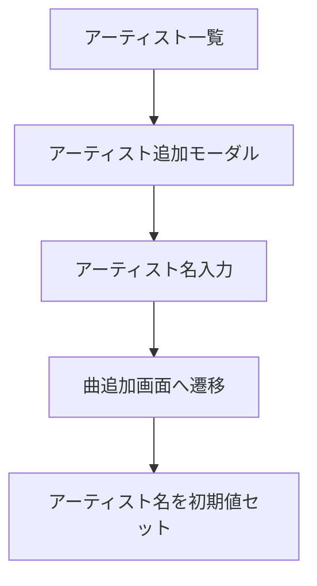

# アーティスト機能設計

## 1. 対象機能

- アーティスト一覧表示
- アーティスト単位の曲展開
- アーティストピン留め
- アーティスト単位の曲追加
- アーティスト単位の全曲削除

## 2. 基本仕様

- アーティストは独立エンティティを持たない
- `Song.artist` を集約して一覧化する
- 一覧にはアーティスト名と曲数を表示する

## 3. 並び順

- ピン留め済みアーティストを先頭表示
- その後はアーティスト名昇順

## 4. アーティスト行の操作

- ピン留め切替
- 曲追加
- アーティスト配下の全曲削除
- 展開 / 折りたたみ

## 5. 展開時の表示

- 所属曲一覧
- 曲ごとの編集
- 曲ごとの削除
- お気に入り表示
- キー表示
- メモ表示

## 6. 追加導線

アーティスト追加は、アーティスト単体保存ではなく、アーティスト名を先に入力して曲追加画面へ進む導線である。

## 7. 削除ルール

- アーティスト削除機能は、そのアーティスト名を持つ曲を全件削除する
- 削除前に確認ダイアログを表示する

## 8. 状態

- `artists`
- `pinnedArtistNames`
- `expandedArtistNames`
- `isLoading`
- `errorMessage`

