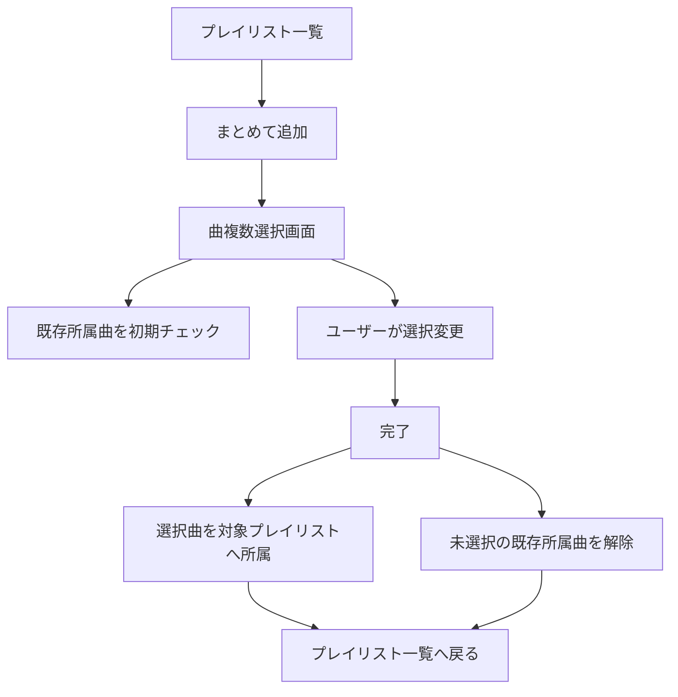

# プレイリスト機能設計

## 1. 対象機能

- プレイリスト一覧表示
- プレイリスト作成
- プレイリスト削除
- プレイリストピン留め
- プレイリスト配下の曲表示
- プレイリストへのまとめて追加

## 2. 基本仕様

- プレイリストは `Playlist` エンティティで保持する
- 曲は `playlistId` により所属を表現する
- 1曲は最大1プレイリストにのみ所属する

## 3. プレイリスト一覧

### 表示項目

- プレイリスト名
- 曲数
- ピン留め状態

### 行操作

- ピン留め切替
- まとめて追加
- 削除
- 展開 / 折りたたみ

## 4. 並び順

- ピン留め済みプレイリストを先頭表示
- その後はプレイリスト名昇順

## 5. プレイリスト追加

- 入力項目はプレイリスト名のみ
- 空文字不可
- 重複不可

## 6. まとめて追加

### 基本挙動

- 対象プレイリストを指定して曲複数選択画面を開く
- 既に所属している曲は初期チェック状態にする
- 完了時に所属状態を一括更新する

### 更新ルール

- チェックされた曲は対象プレイリストへ所属
- 既存所属曲でチェックが外れたものは所属解除

### フロー

## 7. 展開時の表示

- 所属曲一覧
- 各曲の編集
- 各曲の削除
- お気に入り表示
- キー表示

## 8. 状態

- `playlists`
- `pinnedPlaylistIds`
- `expandedPlaylistIds`
- `selectedSongIds`
- `isLoading`
- `errorMessage`

