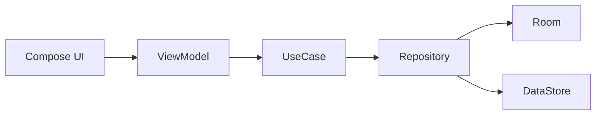
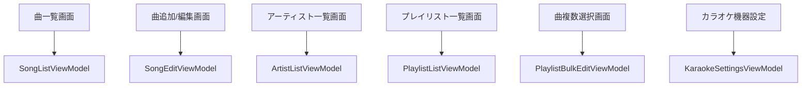

# 状態管理とアーキテクチャ設計

## 1. レイヤ構成

## 2. レイヤ責務

### UI

- 画面描画
- ユーザーイベント送出
- 単純な UI 状態保持

### ViewModel

- 画面状態の組み立て
- バリデーション
- UseCase 呼び出し
- エラーメッセージ管理

### UseCase

- 検索
- 並び替え
- ランダム抽出
- プレイリスト一括更新

### Repository

- Room / DataStore への入出力
- モデル変換

## 3. ViewModel 一覧

- `SongListViewModel`
- `SongEditViewModel`
- `ArtistListViewModel`
- `PlaylistListViewModel`
- `PlaylistBulkEditViewModel`
- `KaraokeSettingsViewModel`

## 4. 代表状態

### SongListState

- `songs`
- `searchQuery`
- `sortType`
- `isLoading`
- `errorMessage`

### SongEditState

- `artist`
- `title`
- `playlistId`
- `key`
- `memo`
- `isFavorite`
- `isSaving`
- `errorMessage`

### PlaylistListState

- `playlists`
- `selectedSongIds`
- `isLoading`
- `errorMessage`

### KaraokeSettingsState

- `currentMachine`
- `settingsByMachine`

## 5. 依存関係ルール

- UI は Repository を直接知らない
- ViewModel は DB 実装を直接知らない
- Repository は UI の状態を知らない
- 検索やソートは UseCase へ寄せる

## 6. 画面と ViewModel の対応

