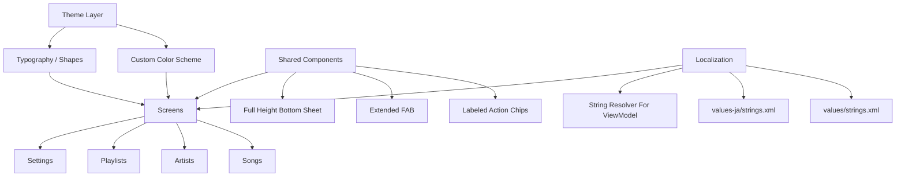

# UI Visual And Localization

## 1. Purpose
This document defines the UI modernization pass for the Android app.

Goals:
- make the app feel closer to a music tool than a generic CRUD app
- replace ambiguous icon-only actions with labeled actions
- improve usability on small screens without increasing cognitive load
- support English and Japanese automatically from device locale
- ensure modal sheets expand fully instead of stopping halfway
- align top-level titles to the top-left for faster scanning

## 2. Visual Direction
The app should look like a personal performance notebook.

Direction:
- deep navy and indigo surfaces as the base
- warm amber and coral accents for interactive emphasis
- rounded cards and chips to make song metadata feel tangible
- soft gradients in the app background instead of flat white
- stronger visual separation between song info, metadata, and actions

## 3. Component Rules
### Top App Bar
- Use a left-aligned `TopAppBar`
- Keep the title prominent and stable
- Move feature actions into the screen body when labels are needed

### Primary Actions
- Use `ExtendedFloatingActionButton` for create actions
- Every primary action must have visible text
- Secondary actions should prefer chips or buttons with text plus icon

### Song / Artist / Playlist Cards
- Show the main identity first
  - song title and artist
  - artist name and song count
  - playlist name and song count
- Show metadata as compact tags
- Show actions as labeled chips, not icon-only clusters

### Modal Sheets
- Use a shared bottom sheet wrapper
- Configure the sheet to skip the partial state
- Keep the title left-aligned at the top of the sheet
- Use consistent spacing and a single save area at the bottom

## 4. Localization Policy
- Default resources are English in `res/values/strings.xml`
- Japanese resources live in `res/values-ja/strings.xml`
- The app supports only English and Japanese
- When the device locale is not Japanese, Android falls back to English
- UI text must use `stringResource(...)`
- ViewModel-driven snackbar messages must be resolved from string resources through an injected resolver

## 5. Accessibility And UX Rules
- Actions should be readable without guessing the meaning of an icon
- Search, sort, random pick, and settings should remain reachable without overflow menus
- Cards should preserve clear tap targets and spacing
- Dialog copy should state the affected entity explicitly
- Empty states should tell the user what to do next

## 6. Implementation Map

## 7. Acceptance Criteria
- Main screens look visually consistent with the music-oriented theme
- Top-level titles are left-aligned
- Major actions are understandable from visible labels
- Bottom sheets open in full mode without stopping midway
- English and Japanese switch automatically from device locale
- Snackbar and dialog messages follow the selected locale
