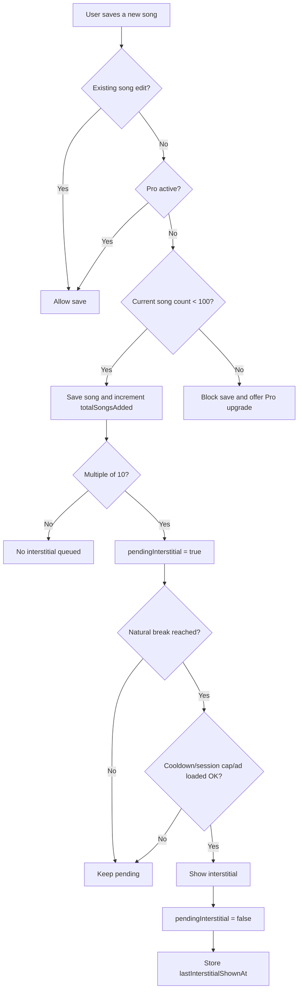
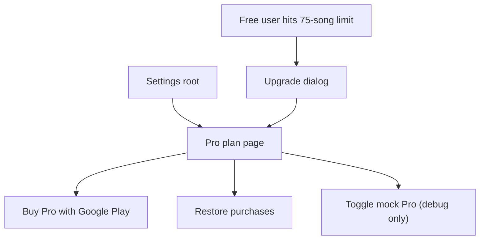

# Monetization

## Goal
- Keep a persistent banner area on each main list screen for free users.
- Add an interstitial path that appears only at natural breaks, never during text entry.
- Introduce a clear `Free / Pro` plan split that is understandable inside the app.
- Use `Google Play Billing` for the real Pro purchase and keep a debug-only mock path for local verification.

## Plan Summary
- `Free`
  - Up to 75 songs
  - Banner ads visible
  - Natural-break interstitials eligible
- `Pro`
  - Unlimited songs
  - Banner ads hidden
  - Interstitials disabled
  - One-time purchase: `JPY 380`

## Free Limit Policy
- Count only saved songs that did not exist before.
- Editing an existing song must remain available even when the free limit has been reached.
- When the free plan already has 75 songs, block only new song creation.
- When the free limit blocks a save, keep the editor open and show an upgrade path to Pro.

## Ad Policy
- Count only successful new song registrations.
- Queue one interstitial opportunity every 10 new songs.
- Do not show the interstitial inside the song editor while the user is still adding songs.
- Show only when the app reaches a natural break.
- Cap interstitials to 3 per app session.
- Enforce a 2 minute cooldown between interstitial impressions.
- If the ad is not loaded when a natural break occurs, keep the opportunity pending and retry on the next natural break.
- When Pro is active, suppress both banner and interstitial ads.

## Natural Breaks
- Song editor dismissed
- Playlist song picker dismissed
- Tab switched between Artist, Song, and Playlist screens

## Purchase Model
- Product type: `one-time in-app product`
- Product id: `karamemo_pro`
- Entitlement source:
  - Real purchase state from Google Play Billing
  - Debug-only mock entitlement for local development
- Purchase restoration:
  - Query existing one-time purchases on app start
  - Query again when the app returns to foreground
  - Allow a manual restore action from Settings

## Runtime Model

## Settings And Upgrade Flow

## Persisted State
- `totalSongsAdded`
- `pendingInterstitial`
- `lastInterstitialShownAtEpochMillis`
- `cachedRealProEnabled`
- `mockProEnabled`

## Session State
- `sessionInterstitialShownCount`
- `interstitialRequestInFlight`
- in-memory `BillingState`
- latest queried `ProductDetails`

## Integration Points
- `PreferencesRepository`
  - persists ad cadence counters
  - persists cached Pro entitlement and debug mock flag
- `BillingRepository`
  - owns `BillingClient`
  - queries product details and purchases
  - acknowledges purchases
  - exposes billing state and purchase events
- `KaraMemoViewModel`
  - combines song data, app preferences, and billing state
  - blocks new saves at the free limit
  - surfaces snackbars and upgrade prompts
- `SettingsScreen`
  - shows the current plan
  - launches purchase and restore actions
  - exposes the debug mock switch only in debug builds
- `AdMobManager`
  - initializes Google Mobile Ads SDK
  - preloads and shows interstitials when allowed
- `AdBanner`
  - renders an adaptive banner in debug with official test IDs
  - is skipped entirely while Pro is active

## Release Handling
- Debug builds use Google test ad IDs so the ad flow can be exercised safely.
- Debug builds expose a mock Pro switch for local verification without Play Console.
- Real Google Play purchases require a matching package name and Play Console product setup.
- Release builds keep ads disabled until real AdMob IDs are supplied.
